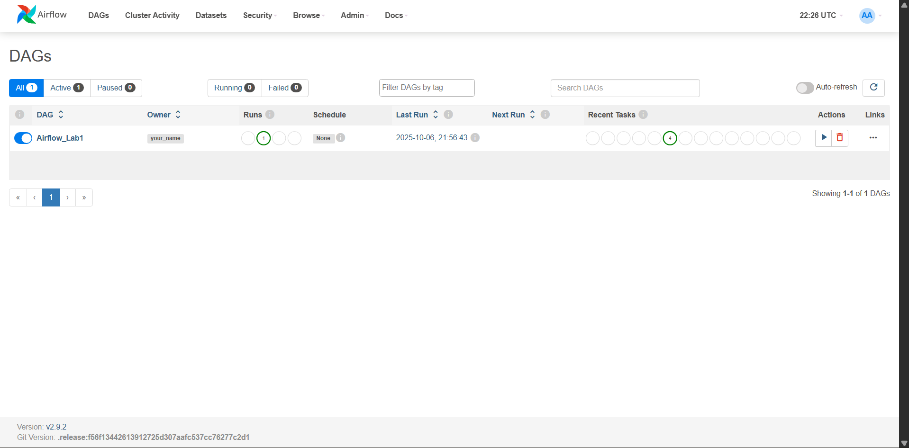
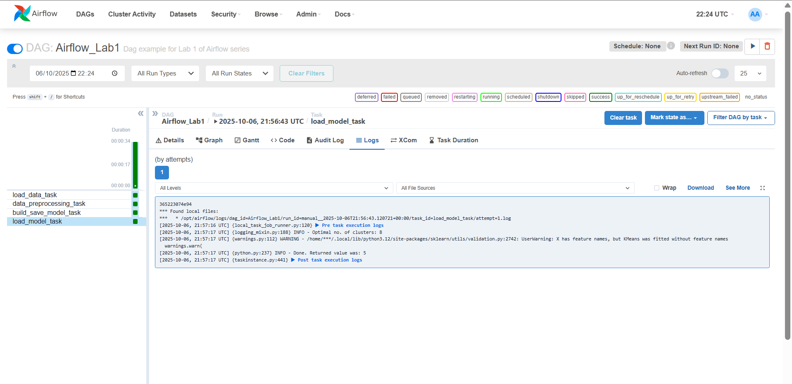

# Apache Airflow Lab - Customer Segmentation with K-Means

## Objective
In this lab, we use **Apache Airflow** to build and automate a simple machine-learning pipeline for **customer segmentation**.  
The pipeline reads data, preprocesses it, trains a clustering model, and saves the trained model — all orchestrated through Airflow tasks.

## Project Structure
```
MLOps-course/
├── fastapi_lab1_env/
├── Lab1_API/
├── Lab2_Airflow/
│   ├── config/
│   ├── dags/
│       ├── data/
│       │   ├── file.csv
│       │   ├── Mall_Customers.csv
│       │   └── test.csv
│       ├── model/
│       │   └── model.sav
│       ├── src/
│       │   ├── __pycache__/
│       │   ├── __init__.py
│       │   ├── lab.py
│       ├── airflow.py
│   ├── logs/
│   ├── plugins/
│   └── working_data/
|   ├── .env
|   ├── docker-compose.yaml
|   └── README.md
```

## Workflow Overview
The Airflow DAG consists of four main tasks:

1. **Load Data**  
   Reads the `Mall_Customers.csv` file and serializes it using `pickle` for efficient data transfer between tasks.  

2. **Preprocess Data**  
   Cleans the dataset (removes missing values) and scales the numeric features using `MinMaxScaler`.  

3. **Train Model**  
   Trains a **K-Means** clustering model across different cluster counts (1–50) and records the **SSE** (Sum of Squared Errors) values to identify the optimal number of clusters using the **Elbow Method**.

4. **Save Model & Predict**  
   Saves the trained model to the `/model` directory and optionally predicts the cluster assignment for new data in `test.csv`.

Each step is represented as a **PythonOperator** in the DAG, scheduled and monitored through the Airflow UI.

---

## Dataset Description - *Mall Customers Dataset*
**Source:** Publicly available dataset on Kaggle and UCI Machine Learning Repository.  

| Feature Name | Description | Type |
|---------------|--------------|------|
| **CustomerID** | Unique identifier for each customer | Numeric |
| **Gender** | Male or Female | Categorical |
| **Age** | Age of the customer | Numeric |
| **Annual Income (k$)** | Annual income in thousands | Numeric |
| **Spending Score (1–100)** | Score assigned based on spending behavior | Numeric |

For clustering, the model uses **Annual Income** and **Spending Score** — two key numerical indicators of purchasing behavior.

## Model Description
The workflow uses the **K-Means Clustering Algorithm**, an unsupervised learning technique that groups customers into *k* clusters based on feature similarity.

**Key steps:**
- Normalize data with `MinMaxScaler` to ensure fair weighting.  
- Run K-Means for *k = 1 → 50* to compute **SSE** values.  
- Use the **KneeLocator** library to detect the “elbow point,” identifying the optimal number of clusters.  
- Train the final model with that optimal *k* and save it to `/model/kmeans_model.pkl`.


## Observations

**Airflow DAG Execution**

The Airflow_Lab1 DAG was successfully deployed and executed in the Airflow environment. The pipeline demonstrates a complete machine learning workflow with the following observations:

- DAG Structure: The pipeline consists of 4 sequential tasks:

- load_data_task - Data ingestion from CSV files
data_preprocessing_task - Data cleaning and transformation
build_save_model_task - Model training and persistence
load_model_task - Model loading and validation

- Execution Status: All tasks completed successfully (shown in green), indicating proper task dependencies and error-free execution.
- Performance: The DAG run completed with all tasks executing in sequence as designed.

**Task Logs**

The logs show successful execution with:

- Pre-task execution logs confirming proper task runner setup
- Task instance logging showing successful completion
- Post-task execution logs validating cleanup operations


**Key Findings**

- The pipeline successfully handles the end-to-end ML workflow from data loading to model deployment
- Task dependencies are properly configured ensuring sequential execution
- The DAG is currently unscheduled (Schedule: None), indicating manual trigger mode
All task attempts succeeded on first try (1/1 attempts)





This implementation demonstrates a working pipeline using Apache Airflow for orchestrating machine learning workflows.
