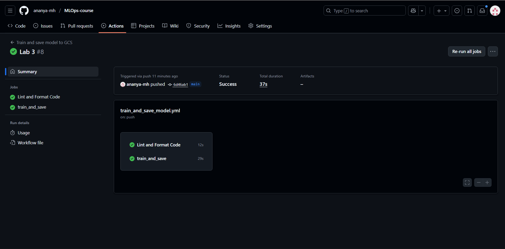
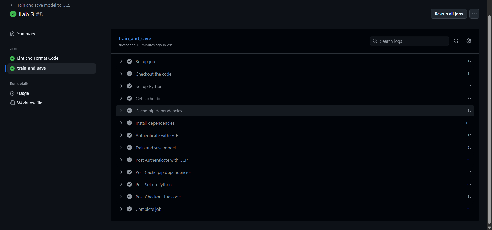
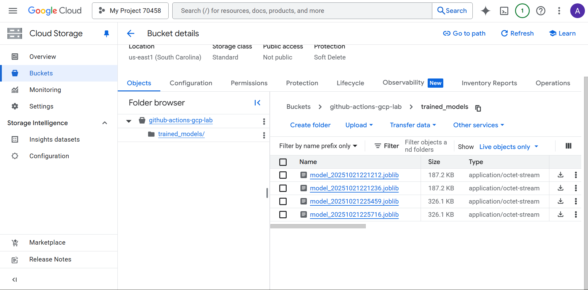

# GitHub Actions and GCP Connections: Beginner Lab

## Overview  
This workflow automates the process of training a machine learning model and saving it to Google Cloud Storage (GCS). It ensures consistent reproducibility through dependency caching and integration with GitHub Actions.

## Dataset  
The model is trained on the **Iris dataset** from `sklearn.datasets`. This dataset contains 150 samples of iris flowers with four features - sepal length, sepal width, petal length, and petal width - classified into three species.

## Workflow Details  
The GitHub Actions workflow performs the following key steps:
1. **Triggers** on:
   - **Push to the `main` branch**  
   - **Manual runs** via `workflow_dispatch`  
2. **Sets up the Python environment** (version 3.10) and **caches dependencies** for faster builds.  
3. **Authenticates with Google Cloud** using a service account key stored in repository secrets.  
4. **Runs a linter (`flake8`) and auto-formatter (`black`)** to ensure consistent code quality.  
5. **Trains the model** using the `train_and_save_model.py` script.  
6. **Uploads the trained model** to the specified GCS bucket.

## Changes Made
- **Dataset changed** from the Iris dataset to the breast cancer dataset. 
- **Trigger updated** to run on push targeting the `main` branch (in addition to manual runs).  
- **Linting and formatting step added** using `flake8` and `black` before model training.  

## Results and Observations
- The workflow executed successfully, confirming correct authentication and cloud storage integration.  

- **Flake8** helped detect minor formatting issues (e.g., blank line and whitespace warnings), which were resolved with `black`.  
- The final trained model file was successfully uploaded to GCS, validating the pipeline’s end-to-end functionality.  

- Automation ensures the model can be retrained and deployed reliably on future pull requests.