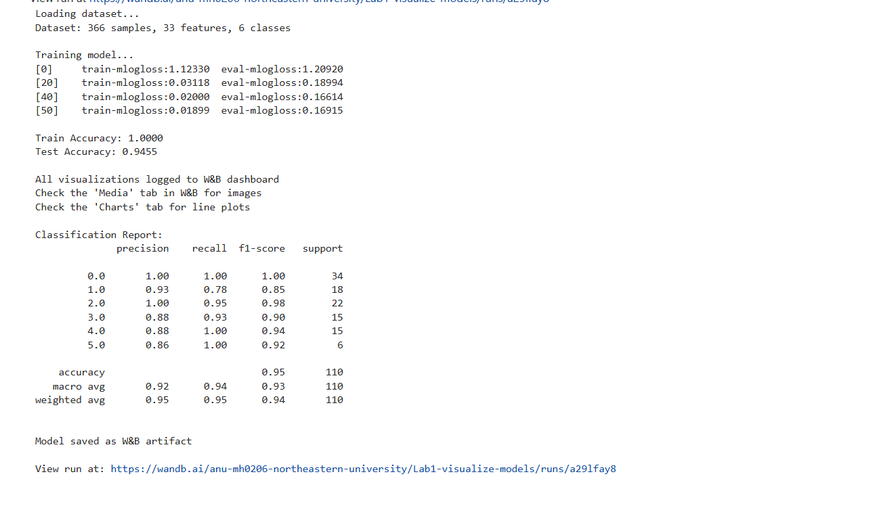
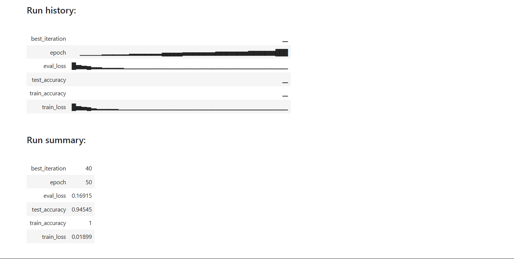
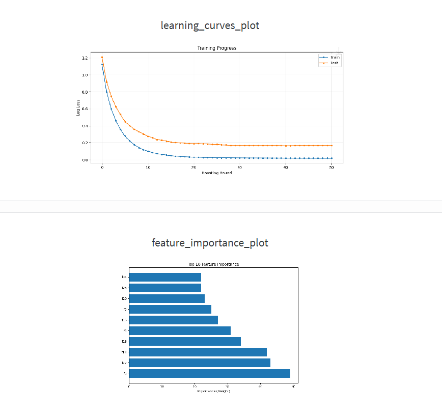

# Lab 1: XGBoost Multi-class Classification with W&B Tracking

## Description
This notebook implements an XGBoost classifier for multi-class classification on the UCI Dermatology dataset. The model predicts 6 different skin disease classes based on 33 clinical and histopathological features. The implementation includes comprehensive experiment tracking using Weights & Biases (W&B) for model monitoring, visualization, and versioning.

**Dataset**: UCI Dermatology Dataset  
**Model**: XGBoost (Gradient Boosting)  
**Task**: 6-class classification  
**Framework**: XGBoost + scikit-learn + W&B

## Changes from Original Notebook

### Data Handling Improvements
- **Updated**: Implemented stratified train-test split using scikit-learn to maintain class distribution and ensure robust evaluation

### Enhanced Configuration
- **Updated**: Exposed 6 key hyperparameters (max_depth, learning_rate, n_estimators, subsample, colsample_bytree) for easier experimentation

### Complete Training Pipeline
- **Updated**: Added full training loop with validation monitoring, early stopping (10 rounds), and progress tracking

### Comprehensive Evaluation
- **Updated**: Added accuracy calculation, classification report with per-class metrics (precision, recall, F1-score), and confusion matrix

### W&B Integration
- **Updated**
Full integration including:
  - Hyperparameter logging
  - Real-time metric tracking (train/eval loss over epochs)
  - Automatic visualization uploads
  - Model artifact versioning

### Visualizations Added
- Confusion matrix heatmap for error analysis
- Feature importance plot showing top 10 influential features
- Learning curves displaying training convergence

## Observations and Results

### Model Performance
- **Training Accuracy**: 100% - Perfect classification on training data
- **Test Accuracy**: 94.55% - Strong generalization to unseen data
- **Best Iteration**: 40 (out of 50 epochs before early stopping)
- Model converged quickly with most learning happening in first 20 iterations

### Class-wise Performance
Based on the classification report:
- **Perfect classification (100% F1)**: Classes 0, 2, and 5
- **Excellent performance (>90% F1)**: Classes 3 and 4
- **Slightly lower performance (85% F1)**: Class 1
- Overall macro average F1-score: 0.93

### Feature Importance Insights
Top contributing features (by weight):
1. **f33** - Most influential feature (50+ importance)
2. **f27** - Second most important (~48 importance)
3. **f2** - Third key feature (~45 importance)

The importance plot shows a clear hierarchy with features f33, f27, and f2 being significantly more influential than others, suggesting these clinical attributes are key discriminators for skin disease classification.

## Conclusion
The customized XGBoost implementation successfully achieves high accuracy (94.55%) on the dermatology dataset with improved tracking and visualization through W&B. 

## W&B Run
View the complete experiment with interactive charts at:  
https://wandb.ai/anu-mh0206-northeastern-university/Lab1-visualize-models/runs/a291fay8