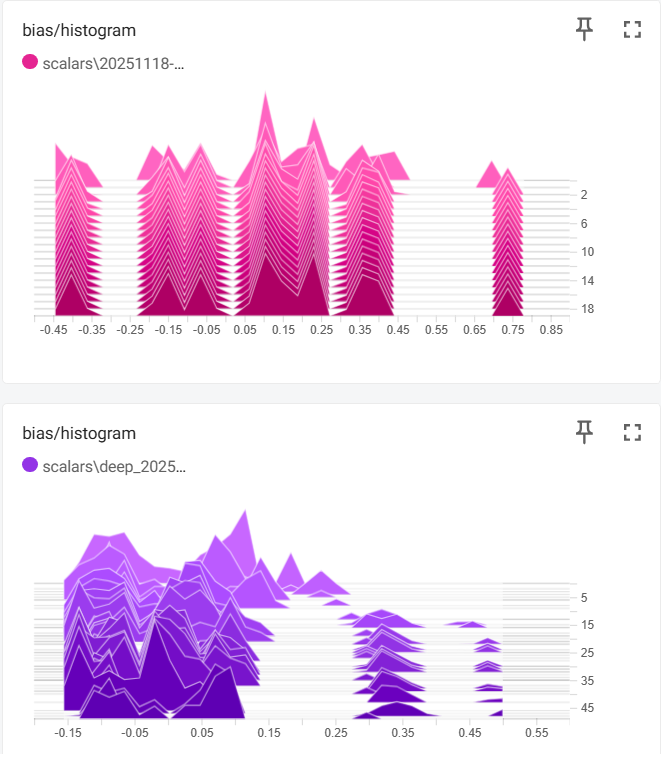
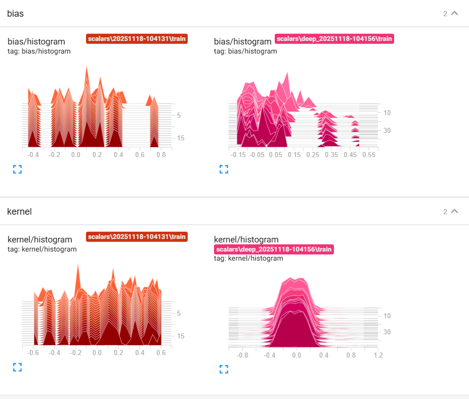
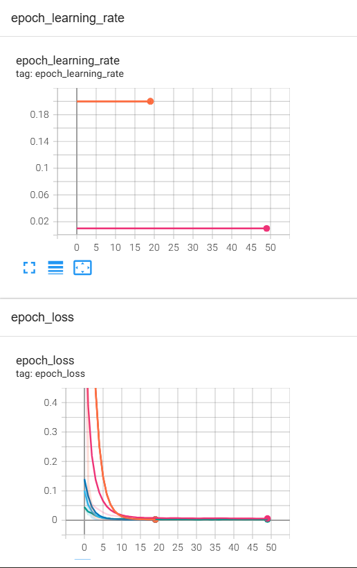

# TensorBoard Visualization Lab

## Overview
This lab demonstrates the use of TensorBoard for visualizing and comparing neural network training processes. TensorBoard provides real-time insights into model performance, architecture, and training dynamics through interactive dashboards.

## Objectives
- Understand TensorBoard's visualization capabilities
- Compare different model architectures side-by-side
- Analyze training metrics and loss curves
- Explore weight distributions and model graphs

## Key Components

### TensorBoard Callback
The lab uses TensorBoard callbacks to log training metrics, model architecture, and weight histograms:
- **Scalars**: Loss and accuracy curves over epochs
- **Graphs**: Neural network architecture visualization
- **Histograms**: Weight and bias distributions
- **Profiling**: Performance analysis of training batches

### Data Generation
Synthetic datasets are used to test model performance:
- Linear relationships with noise

## Modifications Made

### 1. **Enhanced TensorBoard Callback Configuration**
Expanded the basic TensorBoard callback to capture comprehensive training data:
```python
tensorboard_callback = keras.callbacks.TensorBoard(
    log_dir=logdir,
    histogram_freq=1,      # Track weight/bias distributions every epoch
    write_images=True,     # Save model architecture diagrams
    write_graph=True,      # Log computational graph
    update_freq='epoch',   # Update metrics per epoch
    profile_batch='10,20', # Profile performance for batches 10-20
    embeddings_freq=1      # Log embeddings if available
)
```

### 2. **Dual Model Architecture Implementation**
Created two distinct architectures for comparison:

**Simple Model (2 layers):**
- Input → Dense(16) → Dense(1) → Output
- Minimal architecture for baseline performance

**Deep Model (6 layers):**
- Input → Dense(64, ReLU) → Dropout(0.2) → Dense(32, ReLU) → Dropout(0.2) → Dense(16, ReLU) → Dense(1) → Output
- Added ReLU activations for non-linearity
- Incorporated 20% dropout for regularization

### 3. **Differentiated Training Strategies**

**Simple Model Configuration:**
- Optimizer: SGD with high learning rate (0.2)
- Batch size: Full dataset (batch gradient descent)
- Epochs: 20 (sufficient for simple patterns)
- Metrics: MSE loss + MAE for interpretability

**Deep Model Configuration:**
- Optimizer: Adam with lower learning rate (0.01)
- Batch size: 32 (mini-batch for better generalization)
- Epochs: 50 (extended training for complex model)
- Separate TensorBoard directory for side-by-side comparison

### 4. **Model Comparison Framework**
- Automated performance comparison printing final validation losses
- Separate logging directories enable simultaneous visualization in TensorBoard
- Model persistence via `.h5` format for future analysis
- Clear console output showing training progress and final metrics

### 5. **Experimental Design Changes**
- Two separate TensorBoard callbacks with independent log directories
- Different hyperparameters optimized for each architecture's characteristics
- Added MAE metric alongside MSE for better performance interpretation
- Structured output for easy comparison of model performances


## Observations from TensorBoard Visualizations






### Model Architecture Impact
- **Simple Model (2 layers)**: Maintains tight, concentrated weight and bias distributions throughout training, indicating stable and predictable learning behavior
- **Deep Model (6 layers)**: Exhibits wider weight distributions (-0.8 to 1.2 range) and more varied bias patterns, demonstrating the model's capacity to learn complex representations

### Training Dynamics
- **Convergence Speed**: Both models show rapid loss reduction in the first 5 epochs, with the simple model reaching near-zero loss faster on linear data
- **Learning Rate Effects**: Higher learning rate (0.2) with SGD for simple model worked well for basic patterns, while lower rate (0.01) with Adam optimizer provided more stable training for the deep model
- **Loss Curves**: Smooth convergence without oscillations indicates appropriate hyperparameter selection for both architectures

### Weight Distribution Insights
- **Simple Model**: Bell-curved weight distribution centered around zero suggests efficient use of parameters without redundancy
- **Deep Model**: Broader weight distribution with concentration near zero indicates some neurons may be less active (potential for pruning), while extreme values show certain neurons specialized for specific patterns

## Key Takeaways
1. **Model Complexity vs. Task Complexity**: Simple linear data doesn't benefit from deep architectures - the simple model achieved similar performance with fewer parameters
2. **Optimizer Selection Matters**: Adam's adaptive learning helped stabilize the deep model's training despite more parameters
3. **Visual Monitoring Value**: Histograms revealed that the deep model might be over-parameterized for simple tasks (many weights near zero)
4. **No Overfitting Observed**: Training and validation losses converged together, indicating good generalization

These visualizations demonstrate that TensorBoard is invaluable for understanding not just if a model is learning, but how it's learning and whether the architecture matches the problem complexity.